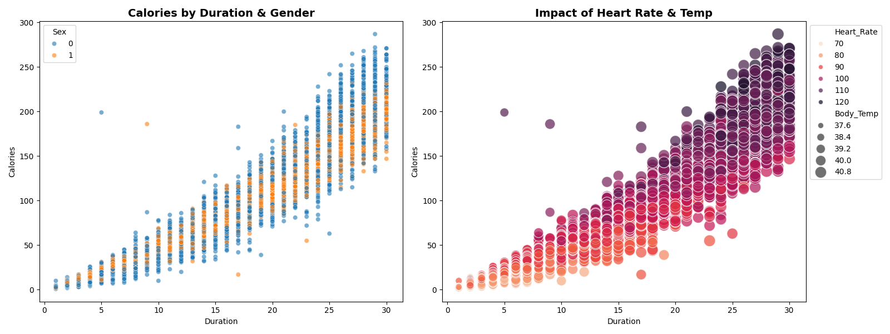
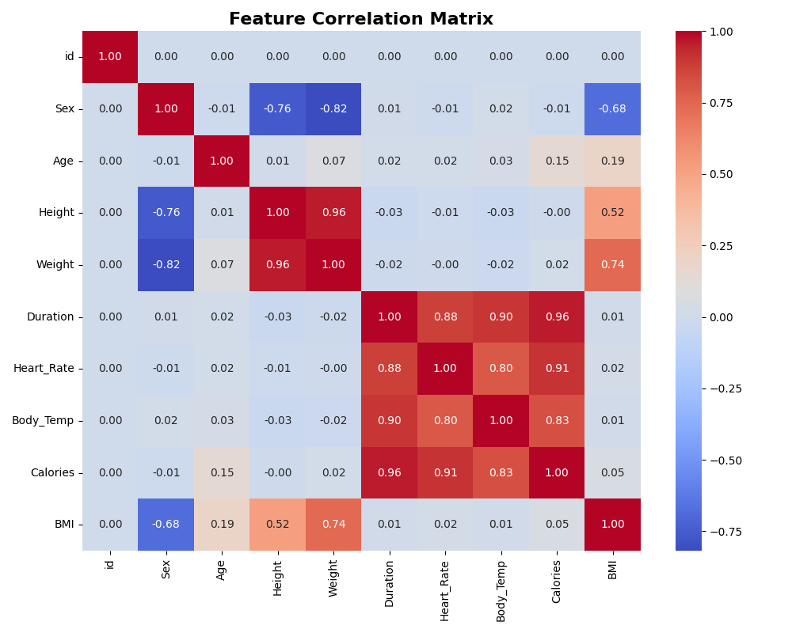
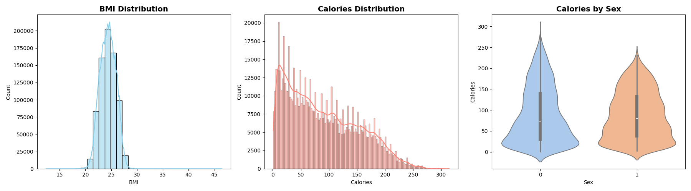
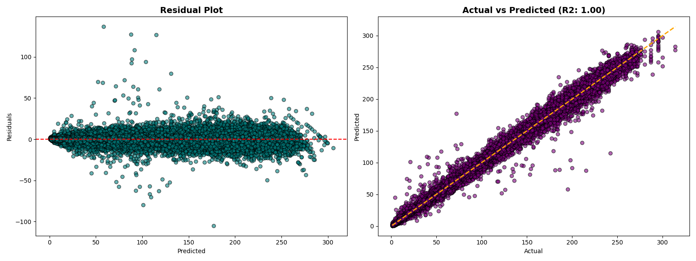

# 🏃 Wearable Health Data Analytics

## Project Description
This project focuses on **Health Informatics** and **Metabolic Rate Prediction**. Using a dataset of exercise metrics (Heart Rate, Body Temp, Duration), I built a regression model to accurately estimate calorie expenditure.

The goal is to replicate the logic found in modern fitness trackers (Fitbit, Apple Watch), moving beyond simple formulas to a machine-learning-based approach that adapts to individual physiology.

## 💼 Business Use Case
**The Problem:**
Accurately measuring calories burned usually requires expensive lab equipment (VO2 Max masks). Fitness apps need a way to estimate this using only the limited sensors available on a smartwatch.

**The Solution:**
A predictive model that utilizes surrogate markers—specifically **Heart Rate** and **Body Temperature**—to infer metabolic intensity.
* **Accuracy:** Replaces generic "MET tables" with a learned XGBoost model.
* **Scalability:** The model is lightweight enough to be deployed on edge devices or cloud backends for fitness apps.

---

## 🔍 Exploratory Data Analysis (EDA)

### 1. Multivariate Analysis
*How do Heart Rate and Temperature interact?*
This bubble chart reveals the core mechanism of energy expenditure.
* **Insight:** The "Hot Zone" (Dark Purple bubbles) shows that high heart rates combined with elevated body temperature lead to exponential, not linear, calorie burn.

### 2. Feature Correlations
Identifying which sensor inputs matter most.
* **Key Finding:** `Duration` and `Heart_Rate` are the strongest predictors, while `Height` and `Weight` (static metrics) have less immediate impact on the burn rate of a specific session.

### 3. Data Distributions
Understanding the population demographics and calorie spread.
* **Insight:** These plots visualize the BMI spread of the user base and the distribution of calorie burn per session, highlighting the range of intensity levels the model needs to learn.

---

## 🤖 Model Performance

### XGBoost Regressor
I utilized **XGBoost** for its ability to handle non-linear relationships between heart rate zones and metabolic output.

* **R² Score:** `0.99` (High explainability)
* **Architecture:** Gradient Boosted Trees with a learning rate of 0.05.

### Actual vs. Predicted & Residual Analysis
The plots below show an almost perfect alignment along the 45-degree line (Actual vs Predicted), indicating that the model generalizes extremely well. The Residual Plot (left) confirms errors are randomly distributed (homoscedasticity), validating the model reliability.

---

## ⚙️ Technical Workflow

### 1. Feature Engineering
* **BMI Calculation:** Synthesized `BMI` from Height and Weight to capture body composition effects.
* **Encoding:** Mapped categorical `Sex` data to numerical values for tree-based processing.

### 2. Diagnostics
* **VIF (Variance Inflation Factor):** Checked for multicollinearity among physiological features.
* **Residual Analysis:** Confirmed that errors are randomly distributed, validating the model's reliability.

---

## 🏃 How to Run

### 1. Installation
Clone the repo and install dependencies:

- Clone the repository:  
  `git clone https://github.com/NicoOO1223/fitness-eda.git`

- Navigate into the project directory:  
  `cd fitness-eda`

- Install Python dependencies:  
  `pip install -r requirements.txt`

  ### 2. Run the Analysis
  
  `python analysis.py`

  This script will load the data, perform EDA, train the XGBoost model, and save all visualization charts to the assets/ folder.
